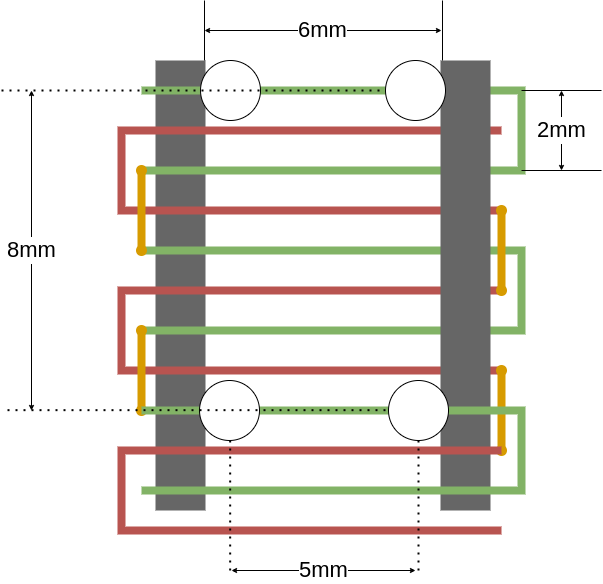

Gauss Speedway
==============

PCB design for the [Gauss Speedway](https://jeffmcbride.net/gauss-speedway/). Designed in Kicad 6.

Demo video: [https://vimeo.com/771275219](https://vimeo.com/771275219)

Firmware: [https://github.com/mcbridejc/speedway-controller](https://github.com/mcbridejc/speedway-controller)

# Assembly

The holes in the corners are designed to accomodate M3 screws for mounting. The PCB mounts into a [3D printable frame](./doc/GaussSpeedway_Frame.stl), which has holes to accomodate M3 threaded heat inserts. You can also get by just putting four stand-offs on the corners.

## Cars

The cars can be printed on an FDM printer. I typically use a small 0.2mm nozzle for finer features. You may need to make some adjustments for your printer, the holes for the magnet can be tricky. Ideally, you have enough of a friction fit that the magnets will stay in place while the glue sets, but enough clearance that you can get them in easily. I typically insert them by placing the magnet on the end of a small flat head screw driver, placing a drop of medium CA into the hole, and then press-fit the magnet into the hole. You have to take care to place the magnets in the correct direction.

There are STL files for two car designs in this repo. [This one](./doc/MagnetCar202211.stl) is the better one, with four magnets spaced properly for the guard rails. Just to show some variety, I also put up a [narrow car](./doc/SkinnyCar.stl) with a single row of three magnets. It works as well, all though it is a bit more prone to flying off the track at high velocity.

You can also design your own cars. You just need to maintain the magnet spacing so that all magnets are on the same current direction. It's also pretty important to keep them light; the force created here is pretty small, and if they get too heavy they may just not move, or they may have a harder time staying on the track around a curve. 

# Status 

Rev 3 is tested and seems to be correct.
